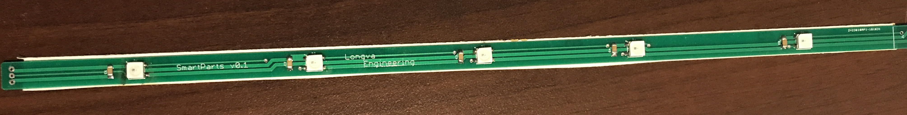
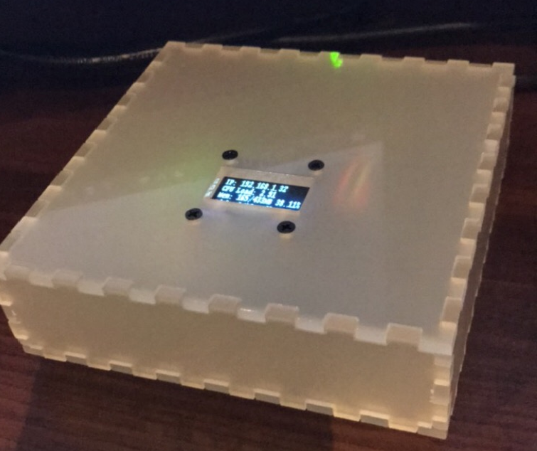
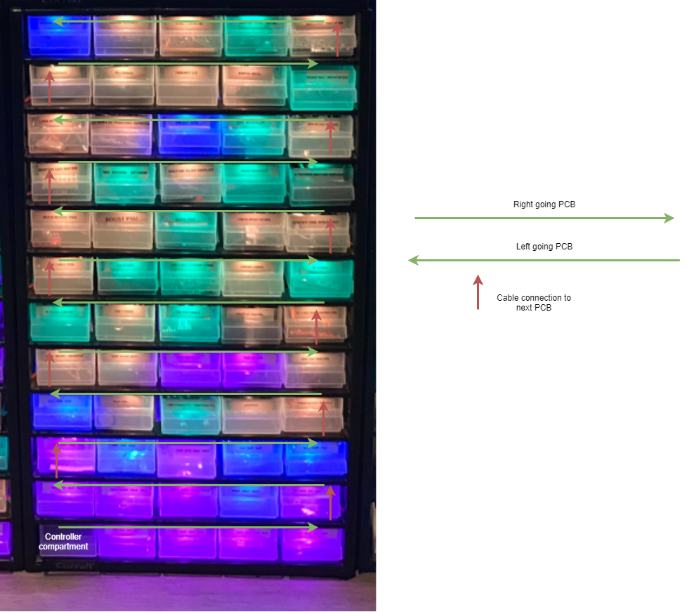
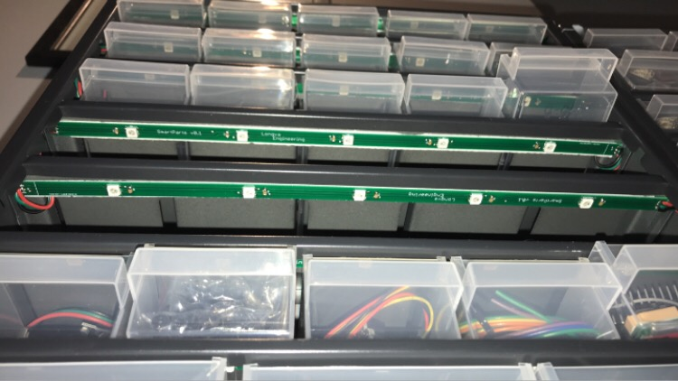
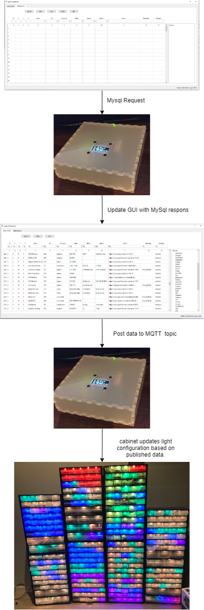

# SmartParts
A smart and glowing storage system for electronic components.  

https://www.youtube.com/watch?v=v1Y57d32keY

Ever since I started working with electronics, the pile of parts has been growing to the point where it took forever to find the correct part. The first step in solving this madnes was to get a cabinet and labelmaker. 
With the cabinet stacked with components, and each drawer labeled, I saw the problem as history.

As a few months passed by, the cabinet was full and i needed another cabinet to store more parts. Bought another cabinet, labeled each drawer with the components that was inside. This repeated itself until i had six cabinets all labeled. 

Now instead of searching in a desk drawer filled with all kinds of parst, i searched 6 cabinets for the correct labeled drawer. This became a pain. So i started thinking of a system that could indicate the correct drawer based on a search. This is when the SmartParts system was born.

The hardware requirements:  
-Raspberry Pi (for running the MySql and MQTT server)  
-Esp8266 controller (one controller for each cabinet)  
-WS2812b LED (one for each drawer)  
-LED PCB (one for each row in the cabinet)  
-WiFi

PCB

  
The LED PCB is optional. You could always buy a roll of the WS2812b leds on ebay and cut it to length. Just a warning, this is what i did in the first cabinet and why i designed the PCB, it is alot of work, the double sided tape falls off and it is a bitch to cut and solder each led.

Cabinet controller (ESP8266)  

This controls the cabinet. When the controller connects to the wifi network, the controller is ready for data input.  
It subscribes to a topic that coresponds to the cabinet number. When the client software publishes data on this topic, the controller will light up leds according to this data. I use one 230v -> 5v 1A power supply for each cabinet (2 pin plug). The 3 pin plug is 5v, GND and data for the leds.  
  
  
Server 

I built a little casing for my Raspberry with a screen showing load and IP address.  
You can use whatever casing you want.  You can run what image you want, as long as it runs an MySql server and an MQTT server.

Cabinet layout

PCB mounting in cabinet

Software requirements:
Arduino IDE with support for ESP8266 + some libs (se source)
Python 3 with paho mqtt, mysql connector and PyQy5
How it all works  
  
  All the parts are stored in a MySql database. Each part has coordinates coresponding to the placement in the cabinets, like an address. This address is composed of four values (W,X,Y,Z).  
W -The cabinet coordinate. 1 = cabinet 1, 2 = cabinet 2, and so on.  
X -The column coordinate. 1 = column 1, 2 = column 2, and so on. I only have 5 columns in my cabinets.  
Y -The row coordinate. 1 = row 1, 2 = row 2, and so on.   
Z -The compartment coordinate. Each drawer can be devided into 4 compartments.   

The Flow of data.  

Whats with the colors?  
When a search is done, the drawers light up with a color. The color indicates the compartment in the drawer the component is in.  
Red empty drawer.  
Yellow first compartment.  
Green second compartment.  
Blue third compartment.  
Purple forth compartment.

https://www.youtube.com/watch?v=v1Y57d32keY

https://www.youtube.com/watch?v=QyOVx2Oqz8I
